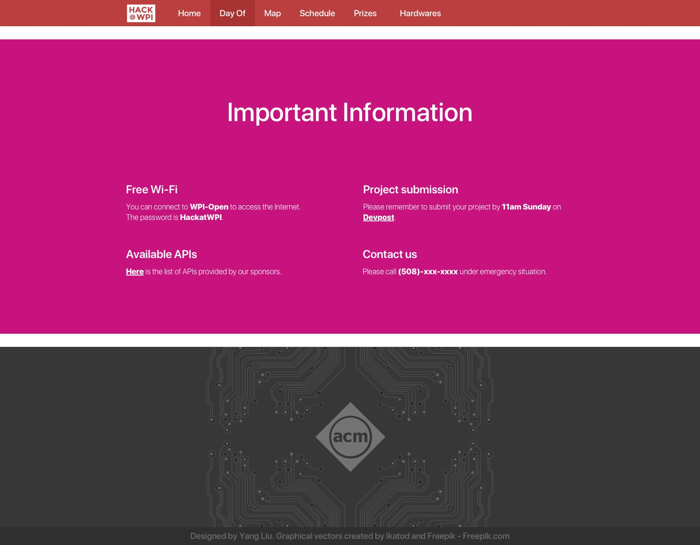
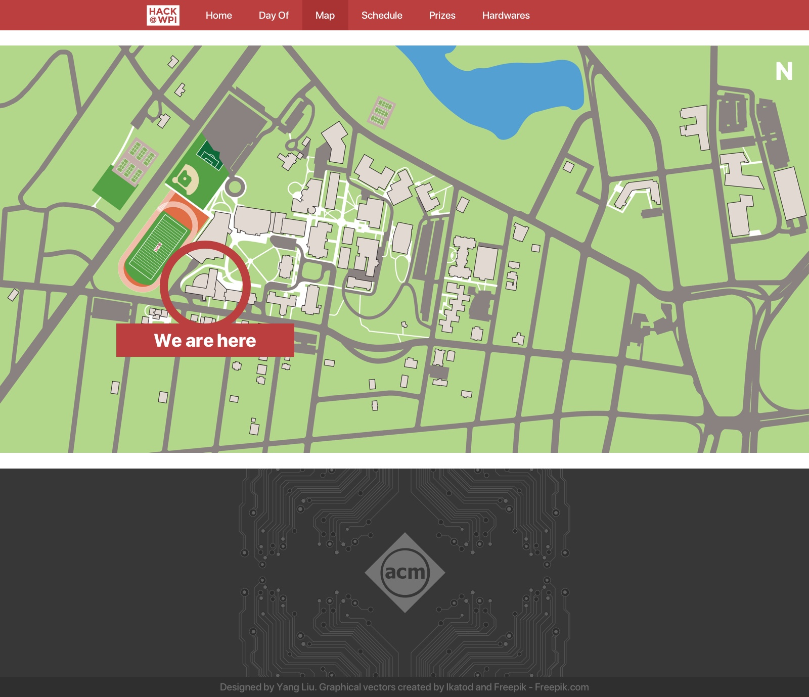

# HackWPI 2018 Design
Design documents for HackWPI 2018

## Preview

## Editing

You need a Mac with [Sketch](https://www.sketchapp.com) installed to open the document.

## Contributing
When contributing to this repository, please first discuss the change you wish to make via issue, email, or Facebook group chat with the owners of this repository before making a change.

1. Ensure any install or build dependencies are removed before the end of the layer when doing a build.

2. Update the README.md with details of changes to the interface, this includes new environment variables, exposed ports, useful file locations and container parameters.

3. Increase the version numbers in any examples files and the README.md to the new version that this Pull Request would represent. The versioning scheme we use is SemVer.

4. You may merge the Pull Request in once you have the sign-off of two other developers, or if you do not have permission to do that, you may request the second reviewer to merge it for you.

## Authors

- **Yang Liu** - *Initial work* - [byliuyang](https://github.com/byliuyang)

## License
This design document is licensed under the General Public License 3.0 - see the [LICENSE.md](LICENSE.md) file for details
